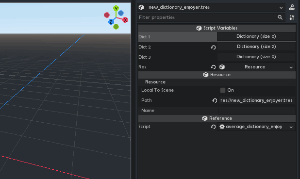

# Dictionary Inspector

Exactly what it sounds like. It edits Dictionaries in the Inspector.

Notable differences from the janky 3.5 and 4.X (*but hopefully soon not!!!*) inspector:

- editable keys (*!!!!!!*)
- adding entries with one button, never forget to click "Add new k/v pair" again!
- when adding, just uses the last edited entry's key/value types
- types can be changed after (*keys too!*)
- when a new Resource entry is added, it creates a copy of the last Resource in collection
- reorder elements in dictionaries (*just like arrays*)
- on open, guesses Resource types for easier creation/quickload

Other features:

- also inspects generic and pool arrays
- nested dictionaries
- nested generic and pool arrays
- drag and drop files onto the "open" button to add multiple resources to array/dictionary (*idk why it was removed in 4.0*)
- resource editing (*click for nested editor or choose "Edit" for classic full-Inspector view, drop multiple into arrays*)

Proposal to integrate this into the engine: https://github.com/godotengine/godot-proposals/issues/5775

#

Made by Don Tnowe in 2022.

[My Website](https://redbladegames.netlify.app)

[My Itch](https://don-tnowe.itch.io)

[My Twitter](https://twitter.com/don_tnowe)

Copying and Modification is allowed in accordance to the MIT license, full text is included.
